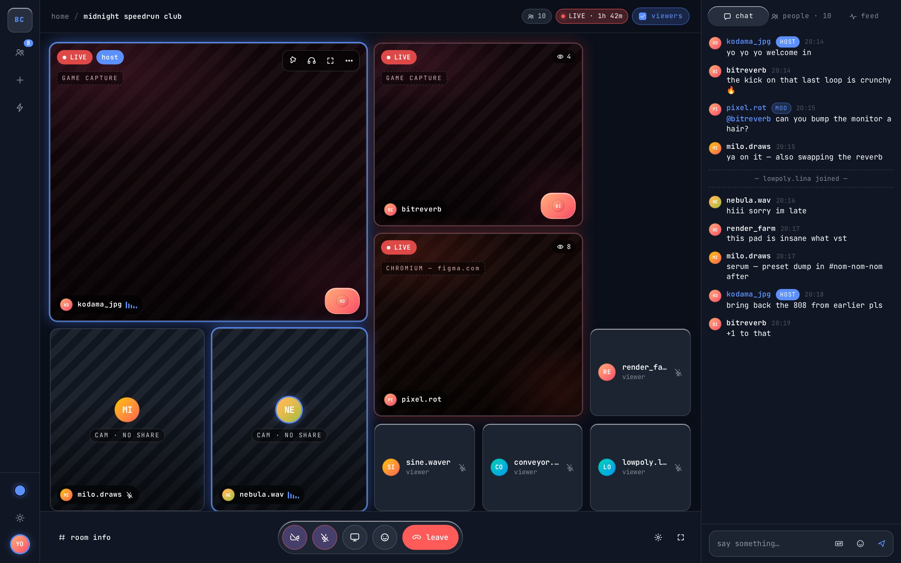
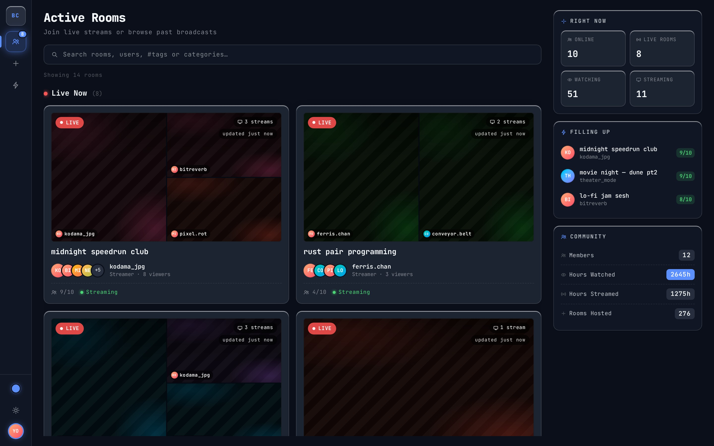
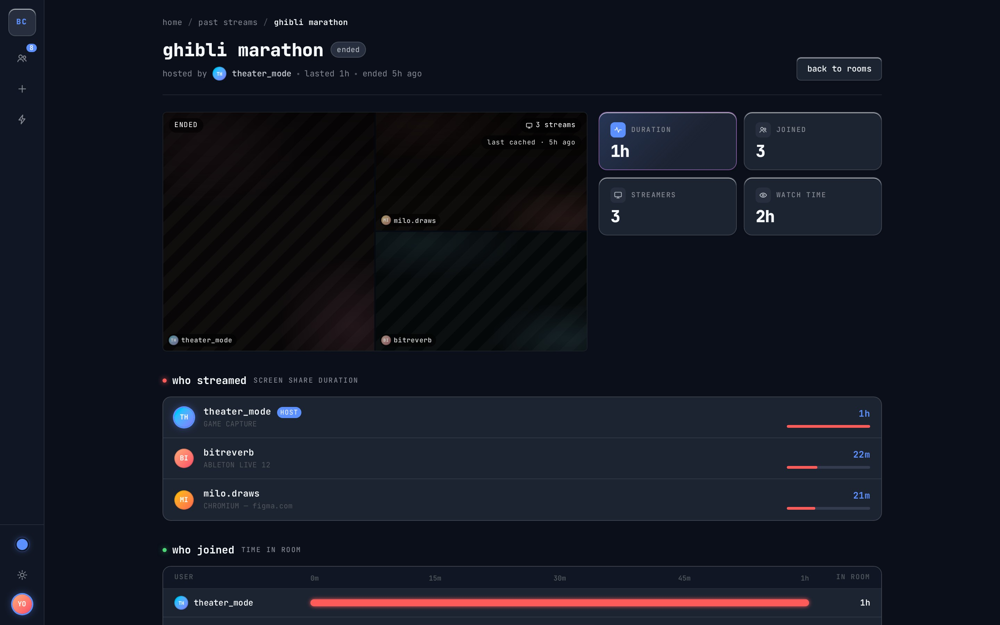
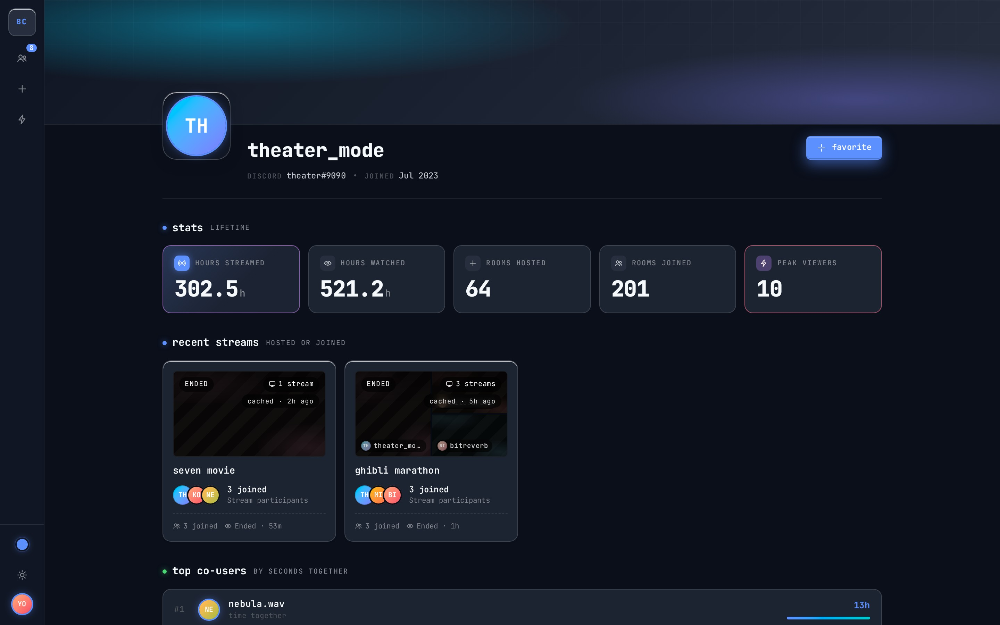
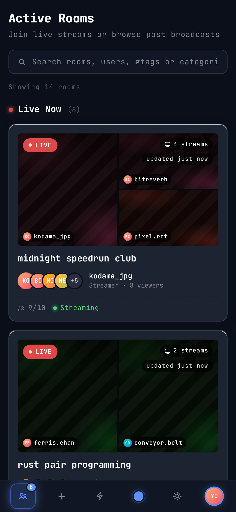
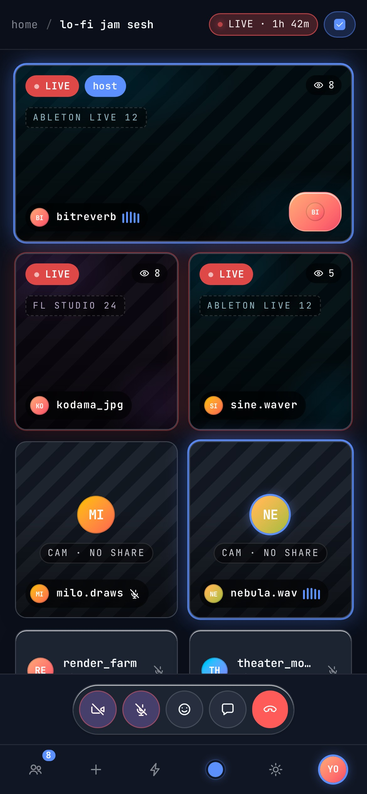

# BhayanakCast

**Your crew. Your screens. One room.**

BhayanakCast is live screen sharing for small groups. Open a room, bring your friends, and share what's on your screen: a game, a movie night, a build that won't compile, or a slide deck you want roasted before Monday.

No downloads. No meeting links that expire. No "can you see my screen?" Sign in with Discord and you're in.

👉 **[Start a room at cast.bhayanak.net](https://cast.bhayanak.net)**

---

## Why BhayanakCast?

### 🖥️ Three screens at once
Up to **3 people can share their screens at the same time** in a room of 10. Watch your friend's ranked match next to your own, or compare two edits side by side. You don't have to take turns.

### ⚡ Sharp and smooth
Streams run at **up to 1080p60** and adjust to each viewer's connection as it changes. If one friend's Wi-Fi struggles, their picture adapts and everyone else's stays sharp.

### 🔊 Sound included
Share tab or system audio along with your screen, with a separate volume slider for each stream. Turn on your mic and camera whenever you want to join in yourself.

### 🔗 Direct connections
Streams travel from browser to browser, not through a central video server. That means less delay and fewer places your screen passes through.

### 🔒 Private when you want it
Make a room private and share an invite link. Everyone who opens it **knocks**, and you decide who comes in. Need to reset access? Generate a new link and the old one stops working.

### 🛡️ You're in charge
Hosts can promote mods, rename the room, stop a share, or remove someone who's ruining the vibe. Your room, your rules.

### 🎛️ Check before you join
The pre-join check lets you pick and preview your mic and camera first. Both start **off**, so you never go live by accident.

### 📼 Recaps of every hangout
When a room ends, its recap stays up for 30 days. You can see who showed up, how long they stayed, and who was streaming.

### 📊 Stats worth bragging about
Your profile keeps track of hours streamed, hours watched, rooms hosted, and your peak viewer count. Favorite the people you hang out with most.

<table>
  <tr>
    <td></td>
    <td></td>
  </tr>
  <tr>
    <td align="center">Recaps of past hangouts</td>
    <td align="center">Your profile and stats</td>
  </tr>
</table>

---

## Works where you are

- **Desktop:** Chrome, Edge, and Firefox are fully supported. Desktop Safari is best-effort: it should work, but it isn't tested.
- **Mobile:** watch, chat, talk, and turn on your camera from your phone. You'll need a desktop browser to share your screen.

  
  &nbsp;&nbsp;
  

---

## How it works

1. **Sign in** with Discord.
2. **Start a room** or jump into one that's live.
3. **Share your screen**, or sit back and watch.

That's all there is to it.

---

  <b>Ready to hang out?</b> 
  <a href="https://cast.bhayanak.net">cast.bhayanak.net</a>

